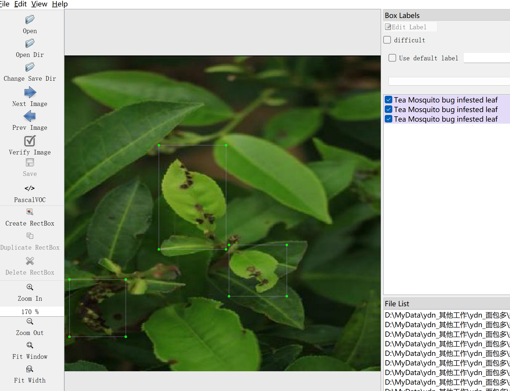

# Tea Leaf Disease Detection Dataset

Dataset Information Introduction: A total of 5411 images are included in this dataset, with each image corresponding to a labeled file. The labeled files are provided in two formats: VOC formatted with XML files and YOLO formatted with TXT files.

The objects that need to be detected include the following:
- Black rot of tea
- Brown blight of tea
- Leaf rust of tea
- Red Spider infested tea leaf
- Tea Mosquito bug infested leaf
- Tea leaf
- White spot of tea
- disease

Each column has the number of images and the number of bounding boxes as follows: (the bounding boxes are usually labeled in English, and the Chinese names within the brackets are for reference)

Note: An image may contain multiple objects, so the total number of bounding boxes may be greater than the total number of images.

The complete dataset consists of three folders and one txt file:
Image size information:
- all_txt folder and classes.txt: Stores the TXT labeled files in YOLO format, with the number of files equal to the number of images. Each labeled file corresponds to an image.
- classes.txt: For a detailed understanding of the standardized file in the YOLO format, please refer to your own research on Baidu. Simply put, the number 0 represents the name at the index 0 in the array in classes.txt.

For the VOC format standardized file, please refer to your own research on Baidu. Both formats can be used, choose one according to your preference.

Annotation screenshot:

## Images

Here is a pay link on Stripe ( https://buy.stripe.com/3cs8yP7sY87d0vu9AB ). Please contact me lonlonago@foxmail.com after funding $89, and I will send you a complete data files , thank you!

